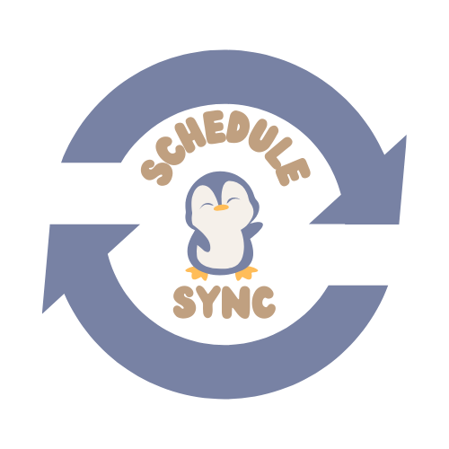

# ScheduleSync

Welcome to **Schedule Sync**, a small-business oriented client management and organization system. (Due to privacy and sensitive data concerns, only the frontend of this project will be pushed). 

If a Demo is required, please let me know in advance!

## Landing Page
- The first thing users will see when interacting with Schedule Sync for the first time will be the **landing page**.

- Business Owners will be directed to sign up or log in to their already existing accounts

## Sign-Up Page
The **Sign-Up** Page allows Business Owners to sign up for an account for Schedule Synce.

- New Users are instructed to add the following information
  - Email
  - Password (Encrypted and Salted for safety concerns)
  - Business Name (Optional)

- Once the Sign-Up Process is complete, the user will be redirected to the Login Page.

## Login Page
The **Login** Page allows new users to sign in into their Schedule Synce Account

- All Users need to do is simply type their Email and Password to login!

## Adminstration-Page
Once Logged in, Users are directed to the Admin-Side of Schedule Sync.

- **Features:**
  - Add Appointments to the Queue for relevant services the business offers.
  - Queues will show position and time for each person.
  - Client view is also offered for Business Owners to see what the platform looks like from a Client perspective.
  - Business Owners also have the option to remove people off the queue for any reason they have.
 

## Client View Page

At the top of the Admin-Page, Business Owners have the option to view the Dashboard from a client view.

- **Features:**
  - Clients can see the Queue position and time remaining.
  - Clients can also add themselves to the waitlist if they so wanted to.
  - Clients can write reviews sent to the Business Owners regarding any experiences they had (Security Features implemented to prevent security attacks)

## Final Thoughts

If you made it all the way here, Thank you for taking a read of my group capstone project. 

This was made with a team of 5 with an endgoal of creating a product that can have impact in local communities. 

In addition, we were also able to learn new languages, frameworks and have the ability to showcase this project at University at Buffalo - State University of New York CSE Demo Day.

